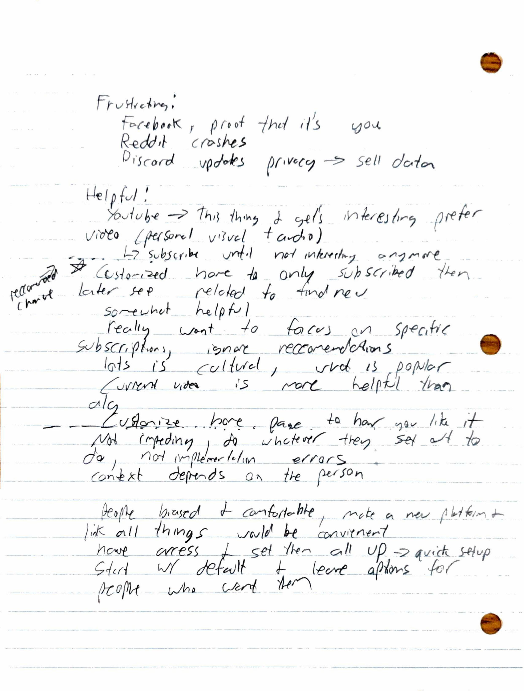

# Assignment 1: Social Media Needfinding

## My Huntch

The theme I would like to explore is the “usefulness” of social media. How well does it help its users accomplish <b><u>their goals</u></b> (i.e. staying connected with others, spending time in community, and any other purposes users might have for it).

## Interviewee 1:

### Info
For this interview I chose to talk to my sister. She brings several valuable perspectives as for a time she communicated entirely over social media for her work and, in contrast to my conception of a general social media user, she almost exclusively uses it to explore online communities and topics. I hoped to understand more about how well her use case is being served by the platforms she uses.

### Summary
It was not a surprise that her most used platforms were YouTube and Reddit. She stated she had previously used both Facebook and Instagram but no longer felt like she had a purpose for them. In expressing the difference she said, “[For YouTube and Reddit] … you look at communities and choose to participate … with Instagram you just followed people back.” This became the beginning of a through-line for discussing how she felt restricted in the ways in which social media allows you to interact with others. She told me that sometimes she is just looking to get to know people who have similar interests, “because that’s how you make friends in real life.” She feels that it should be more like meeting people outside of the digital realm, as when you interact with someone you get the opportunity to control how much you see them and how much they get to know about you. I came to understand that the way many platforms promote interaction is based on a very specific idea of a user, and furthermore discovered that it was only a part of the larger tension she felt due to platforms trading user agency for more simplicity.

Expanding upon this conflict she felt, and in following my hunch about usefulness, I asked about stories in which platforms had helped or impeded her. One thing that immediately surfaced was how much work she had put into trying to get her YouTube feed to work for her. She said she only looked at her subscriptions when initially browsing (having changed several settings to ensure this is all she would see), and <u>only</u> if she was interested in exploring more, would she then look at video recommendations <u>relating to the video she had just watched</u>. “I’m really just not interested in what’s popular,” she elaborated, stating she wished that it was easier to be able to find what she wanted to watch when she wanted. While certainly in a different vein, this cemented the theme of personal control, as well as brought forth consideration for how users discover new content. I look forward to pursuing these ideas and how I might use them to better serve all user populations.

## Interviewee 2:

### Info
For this interview I selected one of my pastors. She moved to Cambridge not long ago, and therefore fosters a lot of remote relationships using social media. Additionally, I believe the platforms she uses and the active presence she curates acts as a healthy contrast to both my own habits and those I anticipate from my other interviewee. I think she will bring forward a lot of considerations having to do both with time and frequency of use (as well as many I haven’t considered from my perspective).

### Summary
I was surprised initially by the wide array of platforms she uses regularly and how specific and diverse her usage was. She enumerated easily a reason for beginning use on each platform, how she accomplished that, and then in many examples what would happen if she continued to use it. When talking about Instagram she explained, “I go on to check the people you know personally but then stay and look for entertainment… For some reason it keeps you on but afterwards you aren’t glad you watched it.” The ways in which social media applications are designed to capture our attention was one of the takeaways I had encountered in my initial research, but it was interesting to hear about how it specifically impacted her experience. Some key observations relating to this occurred during our discussion of her usage of Facebook. She said that she generally has found that you “see all main events within a week” but if you were to not use the app for some time you would fall behind and feel like you’re going to miss what is happening in other people’s lives. Even while using the app, she felt like while options are certainly available to better control what you see (like unfollowing or asking not to recommend), they feel “unnatural” summarizing by saying, “I did do that [referencing some unwanted action one may take] but it’s weird because I don’t feel like I have control.” 

I wanted to follow the tension between what she intended to use social media for and the ways in which it seemingly usurped those desires. After a couple questions regarding what she felt like her purposes for social media were, and some time to reflect, she brought up a very insightful story regarding “the blogger days.” She told me that she felt social media has trended toward a specific template of shortform/photo content and she misses how you used to be able to spend time expressing yourself and learning about others through “richer” content like blogs, stating, “I want to connect with people more personally how they want to interact.” She shared that she used to read a really cool blog from a mentor in high school who would share her experiences baking which then led into personal stories about the recipes and the people she shared the food with. My interviewee enjoyed getting to know more about them, and the many rich ways one might respond beyond a short comment or like. She conceded that it now felt easier to stay updated with everyone but only at a superficial level. Both this idea and those that came prior point towards an apparent discrepancy between what users feel the purpose of social media should be and what it is accomplishing.

## Design points
For my design points I looked for similar themes between the two interviews, as even with very different use cases there were many opportunities that presented themselves (sometimes a little differently) in both.
* <b>Offering more control over the types, quantity, and sources of content users see.</b> In both interviews the users felt dissatisfied with different aspects of the content given to them. I think this is worth exploring as it could give users a stronger feeling of control and better serve those with unique desires and use cases.
* <b>Providing wider options for user-to-user relationships.</b> I don’t believe it was a coincidence that both interviewees discussed this topic using the terms natural/unnatural, as our relationships are often much more complex than a binary on/off. I believe that expanding upon the simple friend/following/subscribed option could create more rewarding experiences and more agency for users in the ways they choose to interact.
* <b>Freedom in content types.</b> Although for different purposes, each interviewee expressed a desire for content other than what they viewed as typical. Experimenting with this could create the space for deeper connection as well as better serve use cases and interests outside of those typical on social media platforms.

## Materials

### Questions
Below is the set of preliminary interview questions I brought into each interview, however not listed are the (arguably much more interesting) follow-up questions that arose from the responses I recieved.

* What platforms do you use?
* What do you do on them?
* Walk me through how specifically you interact with them.
* What do you like/dislike about using them?
* Share with me a frustrating experience you've had using social media.
* Share with me a time you've felt social media was particularly helpful.
* Are their contexts you use social media in where it feels more helpful than others?
* Have you ever felt impeded by a social media platform?
* Do some platforms feel more helpful to you than others?
* What do you feel your general purposes for using social media are?

### Interviewee 1 Raw Notes

### Interviewee 2 Raw Notes

(Also sorry for the blots on the second set. They were in pristine condition for the entire project right up until it was time to scan them)