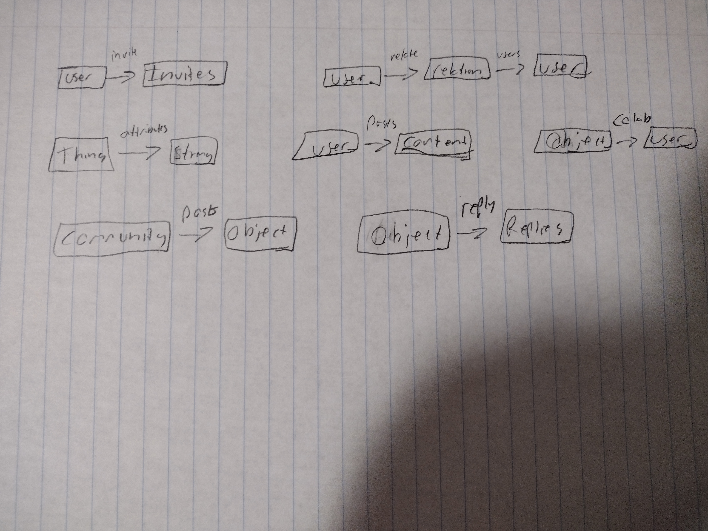

# Assignment 4 Beta

## ADTs

### <b>Concept: </b> Relationshipping  [User]
<b>Purpose: </b> Allow users to create their own relationships  
<b>Principle: </b> After creating a relationship and assigning creator and targets, looking up that pair will yield the relationship.  
<b>State: </b>  
relationTypes: creator -> relationship  
relatedUsers: relationship -> target   
<b>Actions: </b>  
* createRelationship(user: User, relationName: String): relates creator to new relationship in relationTypes
* relate(creator: User, target: User, relationName: String): relates selected relationship under creator to target
* unrelate(creator: User, target: User, relationName: String): unrelates selected relationship under creator to target
* deleteRelationship(creator: User, relationName: String): removes a relationship from relationTypes  
* getRelationship(creator: User, target: User): returns relationships that relates creator to target
* getRelationships(creator: User): returns relationships from creator
* getRelatedUsers(creator: User, relationName: string): returns targets for relationship

### <b>Concept: </b> Privacy Controlling [Thing]  
<b>Purpose: </b> Control what users can see  
<b>Principle: </b> After creating a privacy attribute for an thing and assigning a vlue, one can check and find that atrribute and value using the thing  
<b>State: </b>  
privacyAttribute: thing -> String  
attributeValue: privacyAttribute -> String  
<b>Actions: </b>  
* createAttribute(thing: Thing, attribute: String): relates attribute with thing in attributes 
* assignAttribute(thing: Thing, attribute: String, value: String): relates value with attribute related to thing 
* anyValueSatisfies(thing: Thing, attributeName: String, values: String[]): returns True if checkAttribute is not related to thing or if checkValue is related to checkAttribute related to thing, else False.
* assertAnyValueSatisfies(thing: Thing, attributeName: String, values: String[]): does the same as anyValueSatisfies but throws error if unsatisfied
* deleteAttribute(thing: Thing, attribute: String): unrelates attribute with thing in privacyAttribute  

### <b>Concept: </b> Posting [Content]
<b>Purpose: </b> Allow users to create content for others to see  
<b>Principle: </b> After adding a piece of content it can be found using its creator  
<b>State: </b>  
post: set Posts
content: post -> <b>one</b> Content  
creator: post -> <b>one</b> User  
<b>Actions: </b>  
* createPost(content: Content, user: User): creates an id, adds it to the set of posts, and relates it to content and its user
* updatePost(post: Post, content: Content): changes content associated with post to content  
* deletePost(post: Post): removes post from post and content
* getPosts(user: User): returns all posts related to user  
* getCreator(post: Post): returns creator related to post

### <b>Concept: </b> Collaborating [Object, User]
<b>Purpose: </b> Allows users besides the creator to edit objects  
<b>Principle: </b> After being added to the list of collaborators for an object, one can find that collaborator in the list by using the object  
<b>State: </b>     
collaborators: Object -> user  
<b>Actions: </b>  
* addColab(user: User, object: Object): relates user to object in collaborators  
* removeColab(user: User, object: Object): removes relation between user and object in collaborators  
* checkColab(user: User, object: Object): returns if the user is a collaborator on an object  
* getColabs(object: Object): returns list of users related to an object  
* assertColabs(user: User, object: Object): throws and error if the user is not a collaborator on an object  

### <b>Concept: </b> Inviting [Thing, User]
<b>Purpose: </b> Allows users to send invites to other users to accept or decline  
<b>Principle: </b> After sending an invite for a Thing to target, target can be found using Thing  
<b>State: </b>  
invites: user -> Thing  
<b>Actions: </b>  
* inviteUser(user: User, thing: Thing): relates user to Thing in invites  
* deleteInvite(user: User, thing: Thing): unrelates user to Thing in invites  
* checkInvites(user: User): returns all relations to user in invites  
* userHasInvite(user: User, thing: Thing): throws error if user is not related to thing

### <b>Concept: </b> Content Communitying [Object, User]
<b>Purpose: </b> Create communities where content can be assigned  
<b>Principle: </b> After a community is created and an object is added, that object can be found using the community 
<b>State: </b>  
community: set Community  
owner: community -> User 
posts: community -> Object  
<b>Actions: </b>  
* createCommunity(communityName: string): adds community to set
* addPost(communityName: string, post: Object): relates community and object
* removePost(communityName: string, post: Object): unrelates community and object
* getPosts(communityName: string): returns all objects related to a community  
* deleteCommunity(communityName: string): removes community from set  
* getCommunityByName(communityName: string): returns community with communityName
* getCommunities(): returns all communities  
* assertUserIsOwner(): throws error if user is not owner  

### <b>Concept: </b> Replying [Object]
<b>Purpose: </b> Content can be created as a response to other content  
<b>Principle: </b> After adding an object and selecting an object to reply to, the new object can be found using the other object  
<b>State: </b>  
reply: set Reply 
objectReplies: Object -> reply  
<b>Actions: </b>  
* createReply(content: Object): adds reply to the set of objects  
* removeReply(reply: Object): deletes reply from the set of objects  
* assignReply(object: Object, reply:Reply): relates reply with object in replies  
* removeReply(object: Object, reply:Reply): unrelates reply with object in replies
* getReplyByObject(object: Object): returns all replies related to Object   

### Generics:
User: user from authing
Content: Different content types coming from unlisted content creation concepts  
Object: Post, Reply  
Thing: Object, Content Community

### Privacy Controlling System Attributes:
keyword: actions[]  
reply: reply  
readReplies: get replies  
delete: delete  
read: get object, get collaborators, look at community posts/members  
communityPost: can post to community  

to add or delete colabs you need to be owner

### Graph:

## Backend Repository
https://github.com/e-harbaugh/6.1040-backend  
## Deployed Service
https://6-1040-backend-omega.vercel.app/  

## Reflection
Implementing the backend brought up different questions than I expected to occur. The first thing I noticed was that needing to use ObjectIDs for generics quickly helped me to sort out where to use them and where to use strings and lookups in synchronizations. Eventually I settled on a policy of any case where there are unique string identifiers to utilize them and otherwise to pass the generic types. Furthermore, I needed to add certain getters and assertions to some concepts to implement all the functionality I anticipate using for the app. Some of this came from not understanding the backend structure (particularly that we should avoid having control flow routes.ts) but there were many opportunities to better establish how concepts present their interfaces. One large design decision I came across was in how I designed PrivacyControlling. It is designed to allow both creators to set visibility on their content and for users to filter incoming posts. It greatly simplifies implementation and helps to maintain a cleaner separation of concepts to set system attributes for synchronized actions, but as a trade-off this could cause an incorrect internal model for users if it is not communicated clearly in the front-end when they set up their relationships. The list of specific variables is listed above, and at the moment users are free to edit their values using PrivacyControlling’s interface. I would like to expand more on Posting’s and Replying’s content capabilities, but at the moment I left them as just text due to limited understanding of MongoDB, and if I had more time/knowledge I would have done that differently, and as a side note I found the implicit argument assignment assumptions to be somewhat nebulous and had to sort out several errors due to them.  